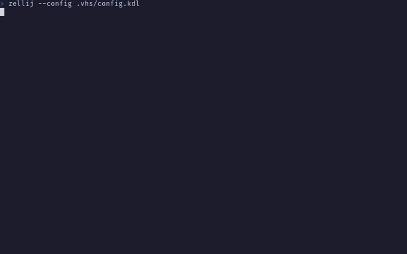

# Getting Started

> **_NOTE:_** The following instructions are for Linux.
> For MacOS you will have to change the download links.
> For Windows the instructions are similar but need to be modified.

1. Install [rustup](https://rustup.rs)
2. Install the stable toolchain
```sh
rustup toolchain install stable
```
3. Add (required) android targets
```sh
rustup target add aarch64-linux-android
rustup target add armv7-linux-androideabi
rustup target add i686-linux-android
rustup target add x86_64-linux-android
```
4. Install [JDK 17](https://www.oracle.com/java/technologies/javase/jdk17-archive-downloads.html)
5. Add the following environment variables
```sh
export JAVA_HOME=/usr
export ANDROID_HOME=$HOME/.android_sdk
```
> *Note:* The `java` binary should be in `$JAVA_HOME/bin/`
6. Install [NDK 25](https://developer.android.com/ndk/downloads)
```sh
mkdir -p $ANDROID_HOME/ndk
wget https://dl.google.com/android/repository/android-ndk-r25c-linux.zip -O temp.zip
unzip -d $ANDROID_HOME/ndk temp.zip
rm temp.zip
```
7. Accept SDK license
```sh
mkdir $ANDROID_HOME/licenses
echo "24333f8a63b6825ea9c5514f83c2829b004d1fee" > $ANDROID_HOME/licenses/android-sdk-license
```
8. Clone the repository & chdir into it
9. Build
```sh
./gradlew build
```

> *Note:* The following packages are required to build the app. gradlew installs them (except ndk) during the first build by default

| Path                 | Version      | Description                     | Location             |
| -------------------- | ------------ | ------------------------------- | -------------------- |
| build-tools;30.0.3   | 30.0.3       | Android SDK Build-Tools 30.0.3  | build-tools/30.0.3   |
| emulator             | 32.1.13      | Android Emulator                | emulator             |
| ndk;25.2.9519653     | 25.2.9519653 | NDK (Side by side) 25.2.9519653 | ndk/25.2.9519653     |
| patcher;v4           | 1            | SDK Patch Applier v4            | patcher/v4           |
| platform-tools       | 34.0.3       | Android SDK Platform-Tools      | platform-tools       |
| platforms;android-33 | 2            | Android SDK Platform 33         | platforms/android-33 |

> If you wish to install the packages manually, follow the following steps instead of step 6

- Install [command-line tools](https://developer.android.com/studio)
```sh
mkdir -p $ANDROID_HOME/cmdline-tools
wget https://dl.google.com/android/repository/commandlinetools-linux-9477386_latest.zip -O temp.zip
unzip -d $ANDROID_HOME/cmdline-tools temp.zip
mv $ANDROID_HOME/cmdline-tools/cmdline-tools $ANDROID_HOME/cmdline-tools/latest 
rm temp.zip
```
- Add to path
```sh
export PATH=$PATH:$ANDROID_HOME/cmdline-tools/latest/bin
```
- Install packages
```sh
sdkmanager "build-tools;30.0.3" "emulator" "ndk;25.2.9519653" "patcher;v4" "platform-tools" "platforms;android-33"
```

# Demo

### FileSystem Monitoring

